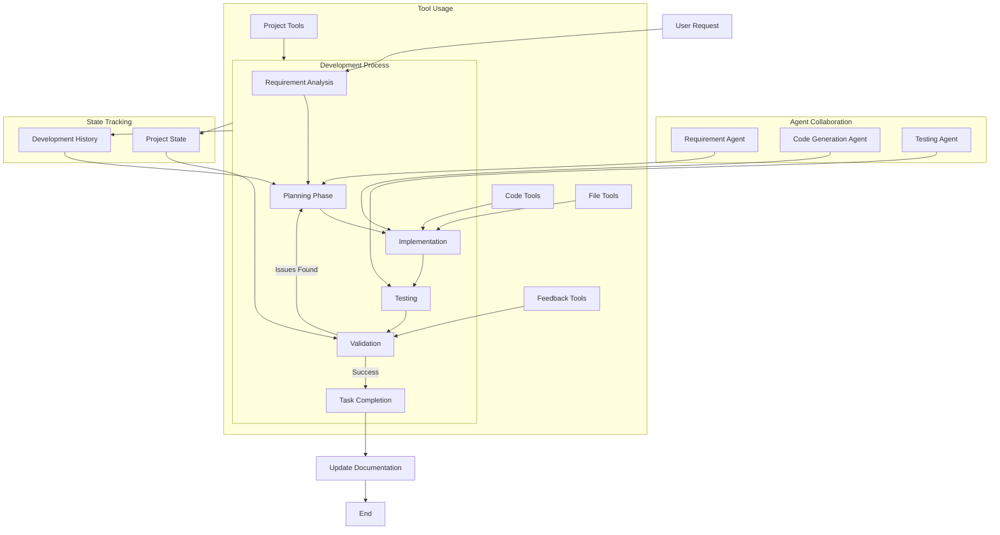

# Development Workflow

This diagram illustrates the development workflow of the system:

1. **Process Flow**:
   - Starts with user request analysis
   - Moves through planning, implementation, testing
   - Validates results and iterates if needed
   - Ends with documentation updates

2. **Agent Roles**:
   - Requirement Agent handles planning
   - Code Generation Agent manages implementation
   - Testing Agent ensures quality

3. **Tool Integration**:
   - Different tools support specific phases
   - Project tools span entire process
   - File and code tools for implementation
   - Feedback tools for validation

4. **State Management**:
   - Tracks project state throughout
   - Maintains development history
   - Influences planning and validation
