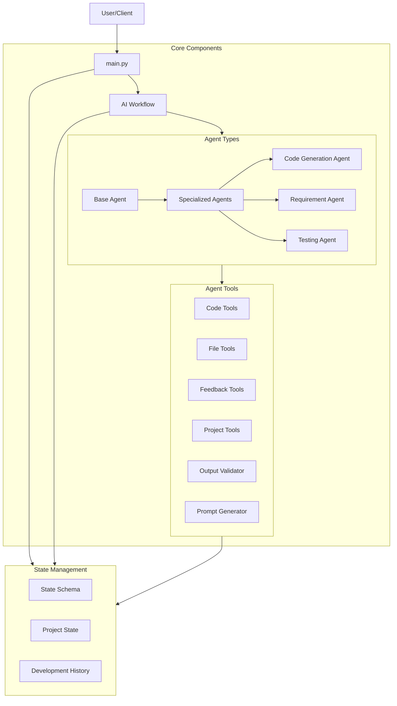

# System Architecture

This diagram illustrates the high-level architecture of the Recursive Development Agent system:

1. **Entry Point**: `main.py` serves as the system entry point
2. **Core Components**:
   - AI Workflow orchestrates the development process
   - Agents (base and specialized) handle specific tasks
   - Various tools provide core functionality
3. **State Management**:
   - Maintains project state and development history
   - Schema defines state structure
4. **Tool Integration**:
   - Tools are used by agents for specific operations
   - Each tool category serves distinct purposes
