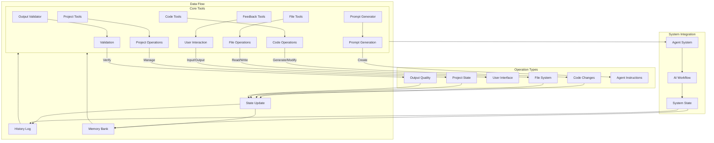

# Tool Interactions and Data Flow

This diagram illustrates the tool interactions and data flow in the system:

1. **Core Tools**:
   - Each tool serves specific functions
   - Tools work together cohesively
   - Clear separation of concerns
   - Structured operations

2. **Operations**:
   - Code generation and modification
   - File system interactions
   - User communication
   - Project management
   - Quality validation
   - Instruction generation

3. **Data Flow**:
   - State updates from operations
   - History logging
   - Memory bank updates
   - Feedback loops

4. **System Integration**:
   - Tools support agents
   - Workflow orchestration
   - State management
   - Documentation updates
